# PlaceIQ Database Schema (v1 design)

PostgreSQL 16, SQLAlchemy 2.0, Alembic. This document covers **all phases** so that Phase 1 tables are designed with the future in mind, but **tables are created only when their feature is built** (see Section 8).

---

## 1. Design principles

| # | Principle | Why |
|---|---|---|
| 1 | **Separate login from profile**: `users` (who can log in) vs `students` (placement data) | Admins, faculty and students share login logic; only students have placement profiles |
| 2 | **Business rules are data, not code**: tiers, policies, score weights live in tables | The Placement Cell changes rules every year |
| 3 | **Master data in lookup tables** (courses, batches, skills, tiers) | Admin can add values without a deploy; reports filter cleanly |
| 4 | **Statuses are `VARCHAR` + `CHECK` constraint**, not native Postgres ENUMs | Native ENUMs are painful to change in migrations |
| 5 | **Never hard-delete placement history**: soft delete (`deleted_at`) on core tables, `ON DELETE RESTRICT` on foreign keys | Reports and audits must stay correct |
| 6 | **Keep history**: status changes and sensitive edits are recorded (`application_status_history`, `audit_logs`) | Disputes, timelines, NAAC evidence |
| 7 | **Snapshot at decision time**: eligibility result is stored on the application | A later CGPA edit must not rewrite history |
| 8 | **Derive, don't duplicate**: "placed" is computed from accepted offers, not stored | Avoids two sources of truth drifting apart |
| 9 | **Use `JSONB` sparingly**, only for snapshots, breakdowns and future-flexible config. Never for data you filter or join on | Keeps queries and constraints simple |
| 10 | **Timestamps are `timestamptz` in UTC** | UI converts to IST |

### Conventions
- Table names: `snake_case`, plural. Primary key: `id` (integer identity, matching the existing `users` table).
- Foreign keys: `<singular>_id`. Always indexed.
- Every table has `created_at`; mutable tables also have `updated_at`.
- Money: `NUMERIC(12,2)` in **INR per year** (UI shows LPA).
- Percentages and CGPA: `NUMERIC(5,2)` / `NUMERIC(4,2)`.
- `ON DELETE CASCADE` only for pure child rows (e.g. `student_skills`). Everything else `RESTRICT`.

---

## 2. ER diagram (core relationships)

```mermaid
erDiagram
    USERS ||--o| STUDENTS : "has profile"
    COURSES ||--o{ SPECIALIZATIONS : has
    COURSES ||--o{ STUDENTS : enrolled
    BATCHES ||--o{ STUDENTS : belongs
    STUDENTS ||--o{ STUDENT_EDUCATION : has
    STUDENTS ||--o{ STUDENT_SKILLS : has
    SKILLS ||--o{ STUDENT_SKILLS : used_in
    SKILLS ||--o{ SKILL_ALIASES : known_as
    STUDENTS ||--o{ STUDENT_PROJECTS : has
    STUDENTS ||--o{ STUDENT_INTERNSHIPS : has
    STUDENTS ||--o{ STUDENT_CERTIFICATIONS : has
    STUDENTS ||--o{ RESUMES : uploads
    STUDENTS ||--o{ STUDENT_DOCUMENTS : uploads
    FILES ||--o{ RESUMES : stored_as
    FILES ||--o{ STUDENT_DOCUMENTS : stored_as

    COMPANIES ||--o{ COMPANY_CONTACTS : has
    COMPANIES ||--o{ DRIVES : conducts
    PLACEMENT_TIERS ||--o{ DRIVES : classifies
    DRIVES ||--|| DRIVE_ELIGIBILITY : defines
    DRIVES ||--o{ DRIVE_ALLOWED_COURSES : limits
    DRIVES ||--o{ DRIVE_ALLOWED_BATCHES : limits
    DRIVES ||--o{ DRIVE_REQUIRED_SKILLS : needs
    DRIVES ||--o{ DRIVE_ROUNDS : has
    DRIVES ||--o{ DRIVE_ATTACHMENTS : has

    STUDENTS ||--o{ APPLICATIONS : submits
    DRIVES ||--o{ APPLICATIONS : receives
    RESUMES ||--o{ APPLICATIONS : used_in
    APPLICATIONS ||--o{ APPLICATION_STATUS_HISTORY : logs
    APPLICATIONS ||--o{ ROUND_RESULTS : has
    DRIVE_ROUNDS ||--o{ ROUND_RESULTS : evaluated_in
    APPLICATIONS ||--o| OFFERS : leads_to
    STUDENTS ||--o{ OFFERS : receives
    COMPANIES ||--o{ OFFERS : issues

    USERS ||--o{ NOTIFICATIONS : receives
    USERS ||--o{ AUDIT_LOGS : performs
    USERS ||--o{ IMPORT_JOBS : starts
```

---

## 3. Phase 1 tables (MVP)

### 3.1 Identity and access

**`users`** (exists; extend with a migration)
| Column | Type | Notes |
|---|---|---|
| id | int PK | |
| email | varchar(255) | unique, indexed |
| full_name | varchar(150) | **add**. Single source of the person's name |
| password_hash | varchar(255) | Argon2. Nullable until the set-password link is used |
| role | varchar(20) | `CHECK IN ('student','admin','super_admin')`; add `faculty`, `company`, `alumni` later (no schema change) |
| is_active | bool | |
| must_change_password | bool | **add** |
| last_login_at | timestamptz | **add** |
| created_at / updated_at | timestamptz | |

**`password_reset_tokens`**: `id`, `user_id` FK, `token_hash`, `purpose` (`activate`/`reset`), `expires_at`, `used_at`. Used for set-password links and forgot-password.

**`refresh_tokens`**: `id`, `user_id` FK, `token_hash`, `expires_at`, `revoked_at`. Enables logout and revocation.

### 3.2 Master data (admin-managed)

| Table | Columns | Notes |
|---|---|---|
| `courses` | id, code (unique), name, level (`UG`/`PG`/`DIPLOMA`), duration_years, is_active | e.g. MBA, MTech |
| `specializations` | id, course_id FK, name, is_active | unique (course_id, name) |
| `batches` | id, label (unique, e.g. "2024-26"), passing_year, is_active | First-class entity, not free text |
| `skills` | id, name (unique), category, is_active | Canonical list |
| `skill_aliases` | id, skill_id FK, alias (unique, lowercase) | "JS" → JavaScript |
| `placement_tiers` | id, name (unique), min_ctc, max_ctc (nullable), rank_order | Normal / Dream / Super-Dream. Thresholds are data |

### 3.3 Students

**`students`**
| Column | Type | Notes |
|---|---|---|
| id | int PK | |
| user_id | int FK unique | one profile per user |
| enrollment_no | varchar(30) | **unique business key** |
| course_id, specialization_id (nullable), batch_id | FKs | |
| current_semester | smallint | |
| cgpa | numeric(4,2) | verified value used for eligibility |
| active_backlogs | smallint | default 0 |
| gap_years | smallint | default 0 |
| gender | varchar(20) | optional, used only for reporting, **never** as a model feature |
| date_of_birth | date | |
| phone | varchar(20) | |
| city, state | varchar | |
| linkedin_url, github_url, portfolio_url | varchar | |
| placement_opt_in | bool | default true; BR-01 |
| verification_status | varchar(20) | `pending` / `verified` / `rejected` |
| verified_by (users FK), verified_at, verification_remarks | | |
| profile_completeness | smallint | 0 to 100, recomputed by service |
| deleted_at, created_at, updated_at | | soft delete |

Notes: **"placed" is not a column.** It is computed: a student is placed if they have an offer with status `accepted` or `joined`.

**`student_education`**, one row per level. This makes UG-percentage eligibility for PG courses (MBA, MTech) possible without adding columns later.
| Column | Notes |
|---|---|
| student_id FK | unique together with `level` |
| level | `CHECK IN ('10th','12th','diploma','graduation','post_graduation')` |
| institution / board, stream, year_of_passing | |
| percentage (numeric 5,2), cgpa (optional) | |

**`student_skills`**: `student_id`, `skill_id`, `proficiency` (`beginner`/`intermediate`/`advanced`), PK (student_id, skill_id).

**`student_projects`**: `id`, `student_id`, `title`, `description`, `tech_stack`, `url`, `start_date`, `end_date`.

**`student_internships`**: `id`, `student_id`, `company_name`, `role`, `start_date`, `end_date`, `description`, `is_verified`.

**`student_certifications`**: `id`, `student_id`, `name`, `issuer`, `issued_on`, `credential_url`.

### 3.4 Files

**`files`**, one generic table for every upload so storage rules live in one place.
| Column | Notes |
|---|---|
| id | |
| storage_key | unique path or object key (random name, never the user's filename) |
| original_name, mime_type, size_bytes, sha256 | validated on upload |
| uploaded_by (users FK), created_at | |

**`resumes`**: `id`, `student_id`, `file_id`, `label` (e.g. "Software resume"), `is_default`, `created_at`.

**`student_documents`**: `id`, `student_id`, `file_id`, `doc_type` (`marksheet`/`id_proof`/`other`), `status` (`pending`/`approved`/`rejected`), `reviewed_by`, `reviewed_at`.

### 3.5 Companies

**`companies`**: `id`, `name` (unique, case-insensitive index), `industry`, `website`, `headquarters`, `description`, `status` (`prospect`/`contacted`/`confirmed`/`blacklisted`), `deleted_at`, `created_at`, `updated_at`.

**`company_contacts`**: `id`, `company_id` FK, `name`, `designation`, `email`, `phone`, `is_primary`.

### 3.6 Drives

One **drive = one job opening** (company + role). If a company hires for two roles, create two drives. A later optional `drive_group_id` can link them without changing anything else.

**`drives`**
| Column | Notes |
|---|---|
| id, company_id FK, tier_id FK (nullable) | |
| title, role_title, description, location, work_mode (`onsite`/`remote`/`hybrid`) | |
| job_type | `full_time` / `internship` / `internship_ppo` |
| ctc_min, ctc_max | numeric(12,2), INR per year |
| fixed_ctc, variable_ctc | optional breakdown |
| bond_months, bond_details | optional |
| drive_date | date |
| registration_deadline | timestamptz |
| status | `draft` / `published` / `registration_closed` / `in_progress` / `completed` / `cancelled` |
| created_by (users FK), published_at | |
| deleted_at, created_at, updated_at | |

**`drive_eligibility`**, one row per drive. Fixed columns for the common rules, and join tables for lists.
| Column | Notes |
|---|---|
| drive_id | PK and FK (1:1) |
| min_cgpa | |
| min_tenth_pct, min_twelfth_pct, min_graduation_pct | compared against `student_education` rows |
| max_active_backlogs, max_gap_years | |
| notes | free-text note shown to students |

**`drive_allowed_courses`**: `drive_id`, `course_id`, `specialization_id` (nullable = whole course). No rows = open to all courses.
**`drive_allowed_batches`**: `drive_id`, `batch_id`. No rows = all active batches.
**`drive_required_skills`**: `drive_id`, `skill_id`, `is_mandatory`. Mandatory skills are a rule; others feed recommendations later.

**`drive_rounds`**: `id`, `drive_id`, `sequence` (unique with drive_id), `round_type` (`aptitude`/`gd`/`technical`/`hr`/`other`), `name`, `scheduled_at`, `mode` (`online`/`offline`), `venue_or_link`, `instructions`. Rounds are configurable per drive.

**`drive_attachments`**: `id`, `drive_id`, `file_id`, `kind` (`jd`/`brochure`/`other`).

### 3.7 Applications and interview tracking

**`applications`**
| Column | Notes |
|---|---|
| id, student_id FK, drive_id FK | **unique (student_id, drive_id)** |
| resume_id FK | resume chosen for this application |
| status | `applied` / `shortlisted` / `in_process` / `selected` / `rejected` / `withdrawn` |
| current_round_id FK (nullable) | which `drive_rounds` row the student is in |
| eligibility_snapshot | JSONB: cgpa, backlogs, percentages, and the result at apply time (principle 7) |
| override_reason, overridden_by | set only when an admin overrides eligibility (BR-09) |
| applied_at, updated_at | |

**`application_status_history`**, append-only, powers the student timeline (INT-06).
`id`, `application_id`, `from_status`, `to_status`, `round_id` (nullable), `changed_by` (users FK), `remarks`, `created_at`.

**`round_results`**: `id`, `application_id`, `drive_round_id`, `result` (`pending`/`cleared`/`rejected`/`absent`), `remarks`, `visible_to_student` (bool), `scheduled_at` (nullable, for individual slots and conflict detection in Phase 2), `updated_by`, `updated_at`. Unique (application_id, drive_round_id).

### 3.8 Offers

**`offers`**
`id`, `student_id`, `company_id`, `drive_id` (nullable), `application_id` (nullable, unique), `role_title`, `offer_type` (`full_time`/`internship`/`ppo`), `ctc`, `location`, `status` (`offered`/`accepted`/`declined`/`expired`/`joined`/`not_joined`), `offered_at`, `responded_at`, `joining_date`, `letter_file_id` (nullable), `created_by`, `created_at`, `updated_at`.

`drive_id` and `application_id` are nullable so off-campus offers and PPOs can still be recorded and counted. A student can hold more than one offer.

### 3.9 System tables

**`notifications`**: `id`, `user_id`, `type`, `title`, `body`, `entity_type`, `entity_id` (deep link), `read_at`, `created_at`.

**`audit_logs`**, append-only. Never updated or deleted by the app.
`id`, `actor_user_id` (nullable for system), `action` (`create`/`update`/`delete`/`status_change`/`override`/`login`), `entity_type`, `entity_id`, `old_values` JSONB, `new_values` JSONB, `ip_address`, `request_id`, `created_at`.

**`import_jobs`**: `id`, `kind` (`students`/`results`/`companies`), `file_id`, `status` (`pending`/`running`/`completed`/`failed`), `total_rows`, `success_rows`, `failed_rows`, `error_report` JSONB (row number + message), `started_by`, `created_at`, `finished_at`. Bulk imports run as a job, so the UI can show progress and a downloadable error list.

---

## 4. Phase 2 tables (add when built; no Phase 1 changes needed)

| Table | Key columns | Purpose |
|---|---|---|
| `placement_policies` | id, name, rule_type (`one_offer`/`tier_limit`/`package_threshold`), config JSONB, effective_from, effective_to, is_active | Policy engine reads these rows. Rules are data |
| `faculty_course_access` | user_id, course_id | Faculty/HOD sees only their courses |
| `announcements`, `announcement_targets` | title, body, created_by; targets by course/batch/drive | Targeted notice board |
| `outbox_events` | id, event_type, payload JSONB, status, attempts, created_at, sent_at | Reliable webhook delivery to n8n (written in the same transaction as the change) |
| `score_configs` | id, name, weights JSONB, is_active | Admin-adjustable employability weights |
| `employability_scores` | student_id, config_id, score, breakdown JSONB, computed_at | Score history with explanation |
| `risk_flags` | student_id, reason_code, details JSONB, created_at, resolved_at | Rule-based flags |
| `data_requests` | student_id, kind (`export`/`delete`), status, handled_by | DPDP rights |
| `company_status_history` (optional) | company_id, from, to, changed_by | Relationship tracking |

Also in Phase 2: `students.profile_completeness` rules, calendar `.ics` generation (no table needed), and `round_results.scheduled_at` conflict checks (column already exists).

## 5. Phase 3 tables

| Table | Purpose |
|---|---|
| `company_users` (company_id, user_id) | Company portal accounts, scoped to their company's drives |
| `drive_attendance` (drive_id, student_id, checked_in_at, method) | QR check-in |
| `alumni_profiles`, `alumni_referrals` | Alumni module |
| `tickets`, `ticket_messages` | Grievance and query system |
| `training_sessions`, `training_attendance` | Training tracking linked to risk flags |
| `resume_parse_results` (resume_id, extracted JSONB, status, confirmed_at) | LLM output the student confirms before it touches the profile |
| `model_runs`, `predictions` (student_id, model_run_id, probability, factors JSONB) | Placement prediction, with version and metrics recorded |
| `user_2fa` | Optional 2FA secrets |

---

## 6. Constraints and indexes to add from day one

**Unique constraints**
- `users.email`, `students.enrollment_no`, `students.user_id`
- `applications (student_id, drive_id)`
- `drive_rounds (drive_id, sequence)`
- `round_results (application_id, drive_round_id)`
- `student_education (student_id, level)`
- `specializations (course_id, name)`, `skill_aliases.alias`, `batches.label`

**Check constraints** on every status/role/type column (see Section 3), plus `cgpa BETWEEN 0 AND 10`, `percentage BETWEEN 0 AND 100`, `ctc_min <= ctc_max`.

**Indexes** (beyond primary keys and unique constraints)
- All foreign keys
- `students (batch_id, course_id)`, `students (verification_status)`
- `drives (status, registration_deadline)`
- `applications (drive_id, status)`
- `offers (student_id, status)`
- `audit_logs (entity_type, entity_id)`, `audit_logs (created_at)`
- `notifications (user_id, read_at)`
- Partial index on `students` and `drives` where `deleted_at IS NULL`

---

## 7. How the schema supports each feature

| Feature | Handled by |
|---|---|
| Bulk student import with row errors | `import_jobs`, `users`, `students`, `student_education` |
| Eligibility engine | `students` + `student_education` + `student_skills` against `drive_eligibility` and its three join tables |
| "Why am I not eligible?" | Engine returns the failed criteria (computed, not stored) |
| Apply once, policy checks | Unique (student, drive), `placement_tiers`, `offers`, later `placement_policies` |
| Live timeline for students | `application_status_history` + `round_results` |
| Bulk result upload | `import_jobs` + `round_results` |
| Placed / unplaced counts | Computed from `offers` (accepted/joined) vs `students.placement_opt_in` |
| Statistics by course/batch/company | Joins on `students`, `courses`, `batches`, `offers`, `companies` |
| Audit and disputes | `audit_logs`, `application_status_history`, `eligibility_snapshot` |
| Employability score, skill gaps, recommendations (P2) | `student_skills`, `drive_required_skills`, `score_configs`, `employability_scores` |
| New roles later (faculty, company, alumni) | New `role` value + small link tables, no change to existing tables |
| Different courses and eligibility rules each year | Data in master tables and `drive_eligibility` |

---

## 8. Build order (create tables with their feature, not all at once)

| Step | Tables | When |
|---|---|---|
| 1 | `users` (extend), `password_reset_tokens`, `refresh_tokens` | Week 2: auth |
| 2 | `courses`, `specializations`, `batches`, `files`, `import_jobs`, `audit_logs` | Week 2: master data and import |
| 3 | `students`, `student_education` | Week 2/3: student import |
| 4 | `skills`, `skill_aliases`, `student_skills`, `student_projects`, `student_internships`, `student_certifications`, `resumes`, `student_documents` | Week 3: profile and verification |
| 5 | `companies`, `company_contacts`, `placement_tiers` | Week 4 |
| 6 | `drives`, `drive_eligibility`, `drive_allowed_*`, `drive_required_skills`, `drive_rounds`, `drive_attachments` | Week 4/5 |
| 7 | `applications`, `application_status_history`, `round_results` | Week 5/6 |
| 8 | `offers`, `notifications` | Week 6/7 |

Why: a migration per feature keeps pull requests small, avoids unused tables, and lets you adjust the design after learning from the previous module.

---

## 9. Decisions to confirm with the team

| # | Decision | Recommendation |
|---|---|---|
| 1 | Integer IDs or UUIDs | **Integer** (matches the current `users` table, simpler). Every endpoint must check ownership. Switch to UUID only if you want non-guessable URLs |
| 2 | One drive = one role | **Yes** for now; add `drive_group_id` later if needed |
| 3 | Education as rows (`student_education`) vs fixed columns | **Rows**, since IIPS has PG programs where UG % matters |
| 4 | Single role per user | **Yes**. Revisit only if someone truly needs two roles |
| 5 | "Placed" computed, not stored | **Computed** from offers. Cache later only if queries are slow |
| 6 | Sensitive fields (gender, category/caste) | Store **gender only** (reporting need). Add `category` only if the Placement Cell confirms a reporting requirement, with restricted access |
| 7 | Multi-institution support | **Not now.** Adding an `institution_id` later is a straightforward migration |

---

## 10. Open questions for the Placement Cell

1. Do eligibility rules use UG percentage for PG students, and which 10th/12th rules apply?
2. Are tiers defined by CTC bands? What are the exact thresholds?
3. Do students have a semester-wise record that must be stored, or only the final CGPA?
4. Do reports need category, gender or other demographic breakdowns?
5. Are off-campus offers and PPOs counted in placement statistics?
6. Can one company run several drives (roles) in the same visit with shared rounds?
